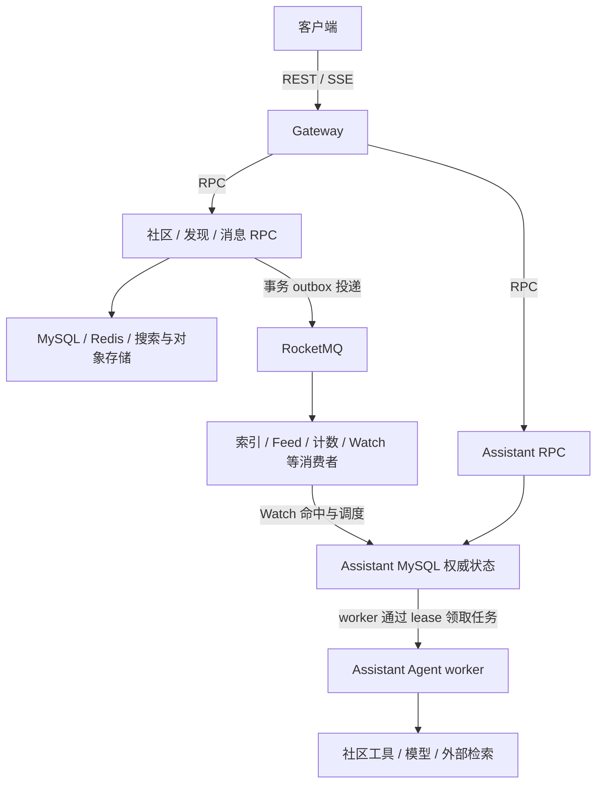

# 小白盒内容社区后端

小白盒的 Go / go-zero 后端，为内容创作、社区互动、内容发现、一对一私信和社区 Agent 提供服务。
仓库名为 `little-white-box-content-community`，Go module 为 `esx`，业务服务共享一个根模块。

内容社区是产品主体，关注流、普通搜索、推荐与社区操作独立于 Agent。小白盒 Agent 帮助用户澄清
复杂需求、优先检索社区资料，在授权范围内补充互联网来源并形成有依据的回答，不以通用陪伴为目标。

[技术架构](#技术架构) · [开发准备](#开发准备) · [常用检查](#常用检查) · [接口与生成](#接口与生成) · [文档导航](#文档导航)

## 定位与能力

| 领域 | 模块职责 |
| --- | --- |
| 社区 | 账户与公开资料、关注关系、帖子草稿与发布、媒体、评论、点赞与收藏 |
| 发现 | 关注流、帖子/用户/标签搜索、个性化与冷启动推荐、行为反馈 |
| 消息 | 普通用户的一对一私信，与 Assistant 虚拟线程保持独立数据边界 |
| Assistant | 授权后的持久任务、结构化澄清、社区优先研究、来源验证、自然语言记忆及 Watch 条件追踪 |
| 异步处理 | 事务 outbox、索引与 embedding 更新、Feed 分发、计数同步、清理、Watch 匹配和行为日志管道 |

以上是产品与模块范围，不是完成度清单。正式要求见知识库；当前实现、已知偏离及验证边界分别由
实现映射、证据与开放门禁记录。

## 技术架构



Gateway 负责 HTTP 入口、鉴权与 RPC 编排，内部 RPC 使用 go-zero / zrpc 与 etcd 服务发现。
Assistant RPC 接收命令并读取状态；模型与工具循环由独立 worker 执行，任务状态持久化到 MySQL，
不依赖浏览器持续在线。Watch matcher 处理事件命中与任务调度，不承担模型执行。

主链路使用 MySQL、Redis、RocketMQ、Elasticsearch、SeaweedFS S3 等基础设施；行为日志进入
ClickHouse。Milvus、embedding 服务与在线推理参与可选算法链路，未启动在线推理时推荐可规则降级。
服务清单、数据流与具体配置见 [架构指南](docs/knowledge/guides/architecture.md)，本图只表达主要协作。

| 目录 | 内容 |
| --- | --- |
| `app/` | Gateway、各领域 RPC、MQ 消费者与 Assistant worker |
| `pkg/` | 跨服务共享的错误、鉴权、事件、MQ、可见性与测试工具 |
| `proto/` | 内部 RPC 契约 |
| `deploy/` | 中间件、生产部署资产与 SQL 基线/补丁 |
| `algorithm/` | 可选在线推理、离线训练与算法验证 |
| `scripts/` / `eval/` | 工程命令实现、评测工具与数据，合成开发数据不等于正式评测 |
| `docs/knowledge/` | 意图、规格、设计、实现、证据与按需操作指南 |

## 开发准备

### 独立检出与检查

准备 GitHub SSH 访问权限、Git、Make、Bash、Go，以及带 venv/pip 的 Python 3。
Go 版本以 [go.mod](go.mod) 为准，当前声明为 `1.27.0`；race 测试还需可用的 CGO/C 编译环境。

```bash
git clone git@github.com:3219378872/little-white-box-content-community.git
cd little-white-box-content-community
go mod download
make help
make knowledge-setup
```

后续命令均从本仓库根目录运行。`make knowledge-setup` 将固定版本的知识解析工具安装到被忽略的
`.venv-knowledge`，不需要修改系统 Python。它只准备文档工具，不启动业务服务或数据库。

### 运行完整应用

完整开发栈由 [根仓 README](https://github.com/3219378872/little-white-box#快速开始)统一编排。
需要完整运行时，按根仓说明递归克隆前后端、准备本地环境文件，再从根仓执行 `just up`。
本仓库没有独立的一键开发启动目标；仅启动 Gateway 不能代替 RPC、中间件与 worker。

本地配置通过环境变量与服务 YAML 注入，不硬编码密钥，也不提交运行时配置副本。
`production-*` 命令属于单独的部署流程，不是本地快速开始，尤其不能用迁移或重建命令探测环境。
开发、配置与排障入口见 [开发与运维速查](docs/knowledge/guides/development-quickstart.md)。

## 常用检查

按改动范围选择检查，不需要为阅读文档启动完整服务。命令定义以 [Makefile](Makefile) 为准。

| 命令 | 检查范围 | 前提 |
| --- | --- | --- |
| `make engineering-lint` | 知识解析测试、文档链接及仓库策略 | 已执行 `make knowledge-setup` |
| `make check` | 格式、文档策略、`go vet` 与 golangci-lint | Go、知识工具、golangci-lint |
| `make test` | 默认 Go 测试，启用 race 与包级覆盖率 | Go、CGO/C 编译环境；不包含 integration 标签测试 |
| `make integration-critical` | 自包含核心集成测试 | 可访问 Docker daemon，可获取依赖镜像 |
| `make integration-all` | 完整隔离集成测试，并清理本轮依赖 | Docker 及集成工具所需环境 |
| `make quality` | 组合 `check` 与 `test` | 上述静态与单元测试工具 |

可用 `make test ARGS="-run TestName -count=1"` 筛选测试。覆盖率、fuzz、算法与评测命令见
`make help` 和 [开发指南](docs/knowledge/guides/development-quickstart.md)。
真实模型、人类质量评审、浏览器/设备和生产观测各需独立验证，不由这些本地检查替代。

## 接口与生成

| 契约 | 作用 | 更新边界 |
| --- | --- | --- |
| [app/gateway/gateway.api](app/gateway/gateway.api) | 公开 REST 与 Dart Gateway SDK 的生成源 | 后端修改契约；前端在自己的仓库同步 SDK |
| [proto/](proto/) 下的 `.proto` | 服务内部 RPC | 不作为 Flutter REST SDK 的生成源 |

修改 `.api` 或 `.proto` 后，在后端仓运行：

```bash
make generate
```

生成需要 `goctl`、`protoc`、`protoc-gen-go`、`protoc-gen-go-grpc` 和 Python 3；Python 生成依赖按
[requirements-generate.txt](scripts/requirements-generate.txt) 安装到隔离环境，运行时确保该环境的
`python3` 在 PATH 中。完整生成过程以 [生成脚本](scripts/generate.sh) 为准。
`make generate` 会写入生成文件，运行后检查差异，不手工修改生成物。

后端生成命令不会跨仓更新 Flutter。公开契约变化后，由前端
[SDK 同步工具](https://github.com/3219378872/little-white-box-front/blob/main/tools/README.md#gateway-sdk-sync)
从已核验版本的 `gateway.api` 更新两份 SDK，并在前端执行带显式 `BACKEND_API` 的只读检查。
整合时根仓 `just contract-check` 会在临时 clone 中检查后端生成漂移，再核对前端 SDK；仍需先备齐
生成工具。两端变更分别提交，根仓最后更新 gitlink。

## 文档导航

| 需要了解 | 入口 |
| --- | --- |
| 开发规则与工作树流程 | [AGENTS.md](AGENTS.md) |
| 按领域定位正式知识 | [五层知识总路由](docs/knowledge/README.md) |
| 产品目标与能力边界 | [后端意图](docs/knowledge/intent/INT-content-community-backend.md) |
| 服务、配置、数据与测试 | [开发指南](docs/knowledge/guides/development-quickstart.md)、[架构指南](docs/knowledge/guides/architecture.md) |
| 当前设计与逐条实现状态 | [设计索引](docs/knowledge/design/README.md)、[实现索引](docs/knowledge/implementation/README.md) |
| 验证记录与尚未完成的验收 | [证据索引](docs/knowledge/evidence/README.md)、[开放门禁](docs/knowledge/status/open-gates.md) |
| 前端与全栈联调 | [Flutter 客户端](https://github.com/3219378872/little-white-box-front)、[根编排仓](https://github.com/3219378872/little-white-box) |

正式知识链为 `INT -> SPEC -> DES -> IMP <-> EVD`；源码、契约、配置与测试是运行时事实依据。
README 不复制完成度数字或历史测试结论；真实模型质量、推荐效果和生产 SLO 以对应实现条款与有效
证据为准。贡献前先读本仓 `AGENTS.md`，在 task 工作树完成修改、验证和提交，不在根编排仓代改后端。
