# esx (little-white-box) 架构与流程规格说明

> 社交内容平台 · go-zero v1.10.1 · Go 1.26.1
>
> 本文以 **Mermaid** 图形化方式描述系统的主要流程图、时序图、数据流转图与协作图。
> 所有图均依据仓库实际代码（`app/`、`proto/`、`pkg/`、`deploy/`）绘制。

## 目录

1. [系统架构总览（组件图）](#1-系统架构总览组件图)
2. [服务协作图（Gateway → RPC）](#2-服务协作图gateway--rpc)
3. [统一请求生命周期（流程图）](#3-统一请求生命周期流程图)
4. [鉴权与 JWT（时序图 + 流程图）](#4-鉴权与-jwt时序图--流程图)
5. [用户注册 / 登录（时序图）](#5-用户注册--登录时序图)
6. [发帖流程 — DTM 二阶段消息 + Fanout（时序图）](#6-发帖流程--dtm-二阶段消息--fanout时序图)
7. [Feed 读写扩散（数据流转图）](#7-feed-读写扩散数据流转图)
8. [评论 / 点赞 / 收藏（时序图）](#8-评论--点赞--收藏时序图)
9. [媒体上传 — gRPC 流式 + S3（时序图）](#9-媒体上传--grpc-流式--s3时序图)
10. [媒体删除事件 — MQ 异步清理（数据流转图）](#10-媒体删除事件--mq-异步清理数据流转图)
11. [搜索索引（数据流转图）](#11-搜索索引数据流转图)
12. [推荐与行为日志管线（数据流转图）](#12-推荐与行为日志管线数据流转图)
13. [私信与通知（时序图）](#13-私信与通知时序图)
14. [事件总线全景（MQ 协作图）](#14-事件总线全景mq-协作图)
15. [错误码与统一响应（流程图）](#15-错误码与统一响应流程图)
16. [部署拓扑（组件图）](#16-部署拓扑组件图)
17. [整体数据流转全景图](#17-整体数据流转全景图)

---

## 1. 系统架构总览（组件图）

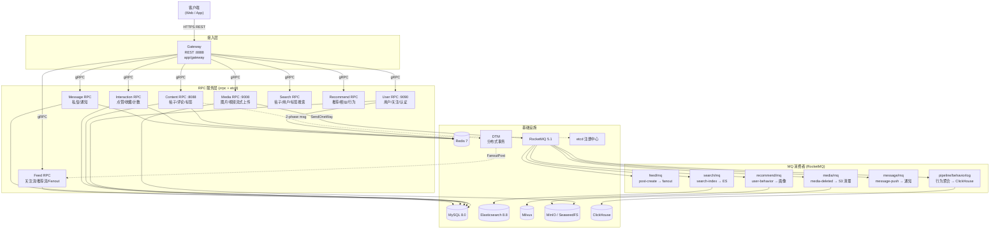

---

## 2. 服务协作图（Gateway → RPC）

Gateway 在 `app/gateway/internal/svc/service_context.go` 中注入 5 个 zrpc 客户端（均带 `bizErrInterceptor` 业务错误拦截器），按业务域路由到各 RPC。

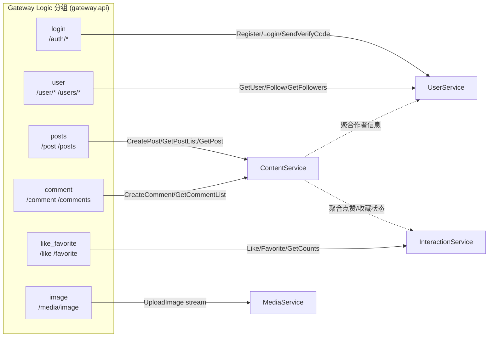

> 协作约定（CLAUDE.md 硬性规则）：Handler 仅做参数绑定/调用 Logic；Logic 经 `svc.ServiceContext` 取资源并透传 `ctx`；跨服务一律走 zrpc 且透传入参 `ctx`。

---

## 3. 统一请求生命周期（流程图）

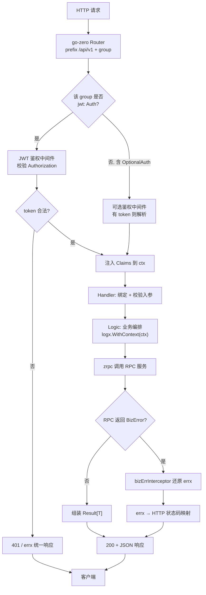

---

## 4. 鉴权与 JWT（时序图 + 流程图）

`pkg/jwtx/jwt.go`：`GenerateToken` 签发、`ParseToken` 校验（已防 `alg=none` / 算法混淆攻击），`WithClaimsContext` / `GetUserIdFromContext` 完成上下文透传。

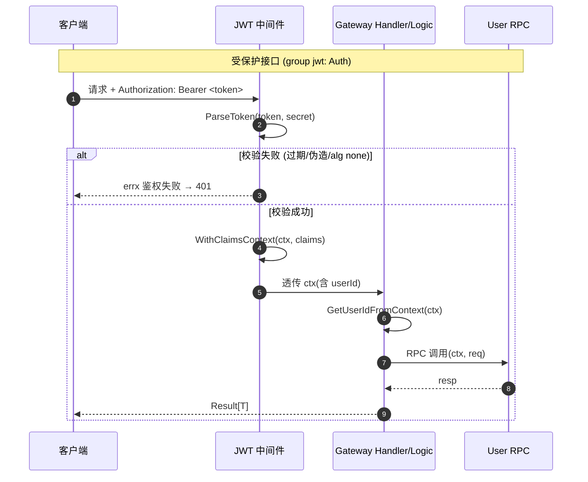

JWT 校验内部判定：

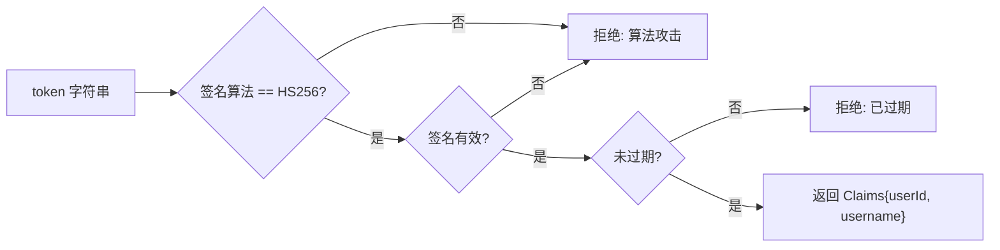

---

## 5. 用户注册 / 登录（时序图）

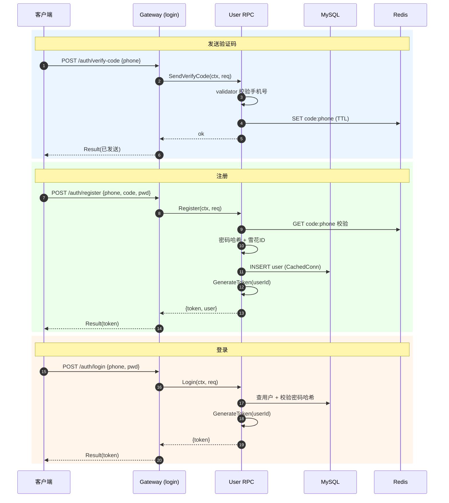

---

## 6. 发帖流程 — DTM 二阶段消息 + Fanout（时序图）

`app/content/rpc/internal/logic/create_post_logic.go`：使用 **DTM 二阶段消息（2-phase message）** 保证「写库（帖子 + 标签，同一事务）」与「触发 Feed Fanout」的最终一致性。屏障表通过 `Content.QueryPrepared` 实现。

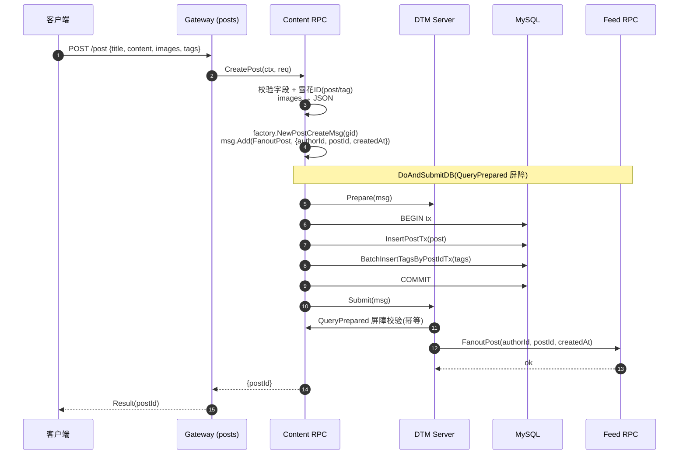

> 若任一分支失败，DTM 依据屏障表自动重试 / 回滚，避免「写库成功但 Fanout 丢失」或重复投递。

---

## 7. Feed 读写扩散（数据流转图）

Feed 采用 **推拉结合（写扩散 + 读扩散）**：

- **普通作者**：写扩散 —— Fanout 时分页拉取粉丝（`GetFollowers`），批量写入每个粉丝的 `feed_inbox`（收件箱）。
- **大 V**（`FollowerCount >= BigVThreshold`）：只写作者 `feed_outbox`（发件箱），**不**写扩散；读取时由消费方按需拉取，避免热点风暴。

逻辑见 `app/feed/mq/internal/logic/fanout.go`。

```mermaid
flowchart TD
    Start["FanoutPost 事件<br/>{authorId, postId, createdAt}"] --> GU["UserSvc.GetUser(authorId)"]
    GU --> OUT["InsertIgnore feed_outbox<br/>(作者发件箱, 幂等)"]
    OUT --> J{"FollowerCount >=<br/>BigVThreshold?"}
    J -->|是 (大V)| BIGV["仅保留 outbox<br/>读扩散: 读时拉取<br/>结束"]
    J -->|否 (普通)| PAGE["分页 GetFollowers<br/>pageSize = FanoutBatchSize"]
    PAGE --> BUILD["构建 FeedInbox 行<br/>{userId, authorId, postId, createdAt}"]
    BUILD --> MORE{"还有下一页?"}
    MORE -->|是| PAGE
    MORE -->|否| INS["BatchInsertIgnore feed_inbox<br/>(粉丝收件箱, 幂等去重)"]
    INS --> Done["完成"]

    BIGV --> Done
```

读取关注流时合并两个来源：

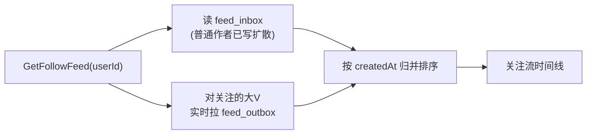

---

## 8. 评论 / 点赞 / 收藏（时序图）

帖子详情页通常需要 Content（帖子/评论）与 Interaction（点赞/收藏状态与计数）协同。

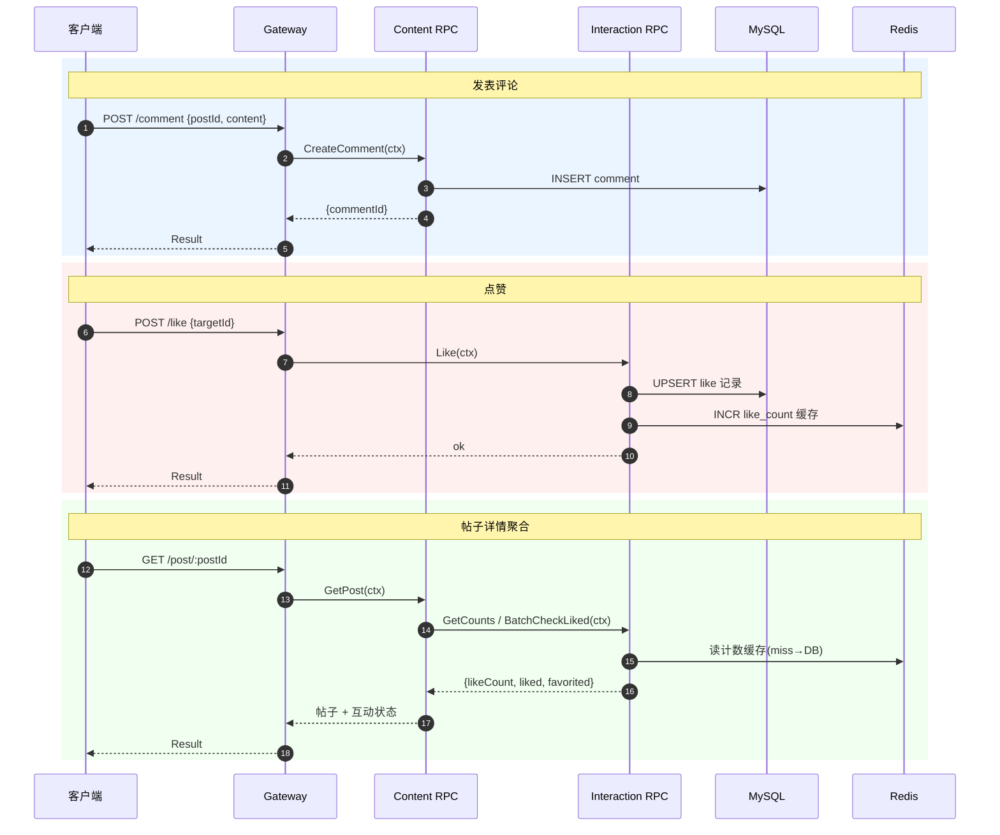

> 互动写操作（Like/Favorite/Comment/Follow）同时作为 **行为事件源**，进入推荐画像与行为日志管线（见 §12、§14）。

---

## 9. 媒体上传 — gRPC 流式 + S3（时序图）

`media.proto` 中 `UploadImage` / `UploadVideo` 为 **客户端流式（stream）** RPC。Gateway 将 HTTP 上传体分块通过 `stream.Send` 转发给 Media RPC，落地 MinIO / SeaweedFS（S3 兼容）。

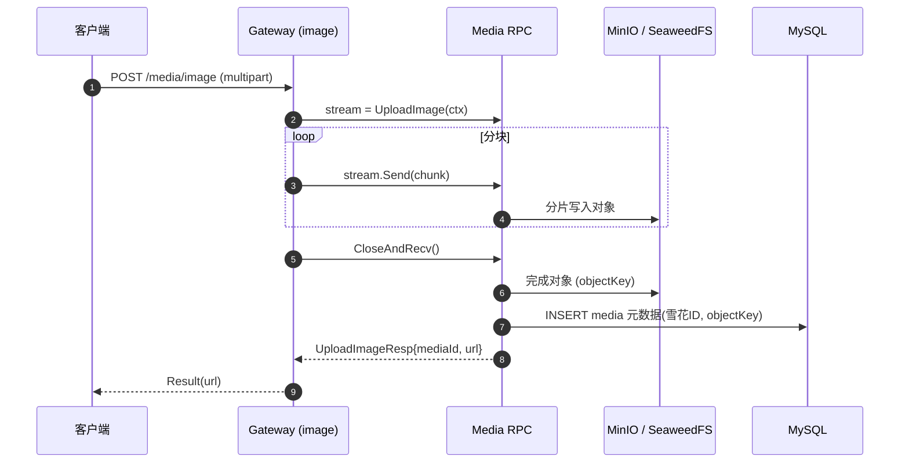

---

## 10. 媒体删除事件 — MQ 异步清理（数据流转图）

`app/media/rpc/internal/logic/delete_media_logic.go` 删除元数据后，向 `media-deleted` topic 发 **SendOneWay** 消息；`app/media/mq` 的 `media_cleanup_consumer` 消费并删除 S3 对象，实现「元数据即时删除 + 存储异步回收」解耦。

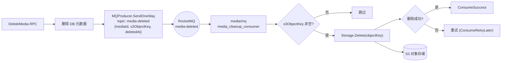

---

## 11. 搜索索引（数据流转图）

`app/search/mq` 的 `search_consumer` 订阅 `search-index` topic，按事件类型对 Elasticsearch 做 `Index` 或 `Delete`；查询路径由 Search RPC 直接读 ES。

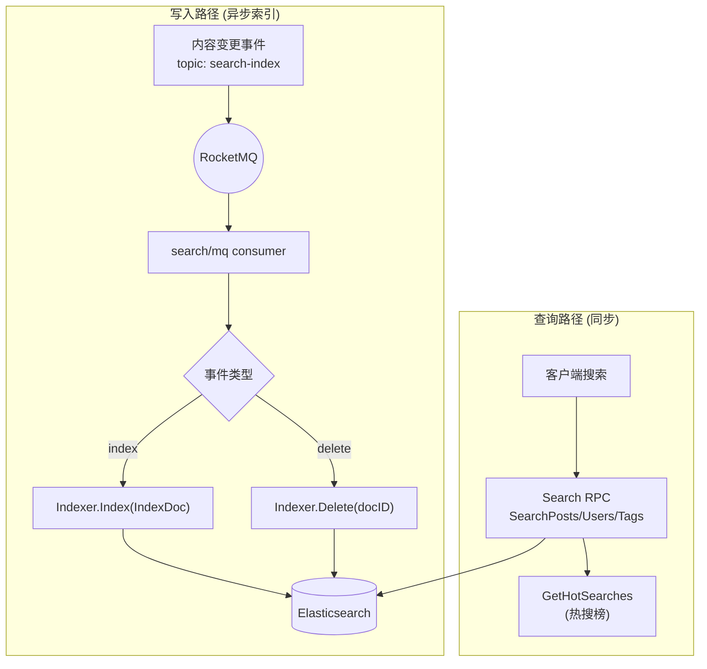

---

## 12. 推荐与行为日志管线（数据流转图）

用户互动行为（点赞/收藏/评论/关注等）作为统一事件源，**双路消费**：

- **Recommend**：`recommend/mq` 订阅 `user-behavior` → 更新用户画像 → 写入 Milvus 向量，支撑 `GetRecommendPosts` / `GetSimilarPosts`。
- **Behavior Log**：`pipeline/behaviorlog` 订阅多种行为 topic（`like/unlike/favorite/unfavorite/comment-create/user-follow/user-unfollow`），经 **布隆过滤器去重** 后批量写入 ClickHouse 供离线分析。

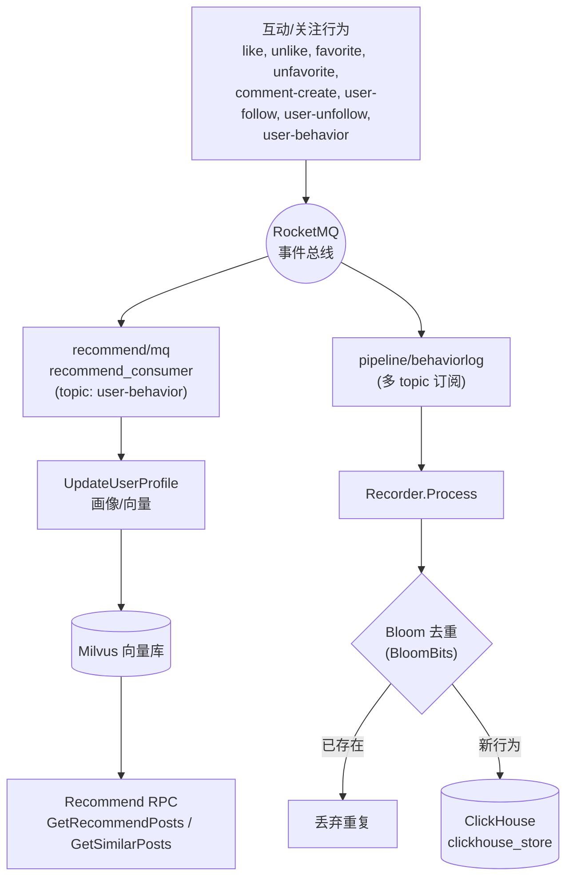

---

## 13. 私信与通知（时序图）

`message.proto` 提供私信（会话/消息/已读/未读数）与通知；`message/mq` 订阅 `message-push` 渲染并落地通知、清理未读缓存。

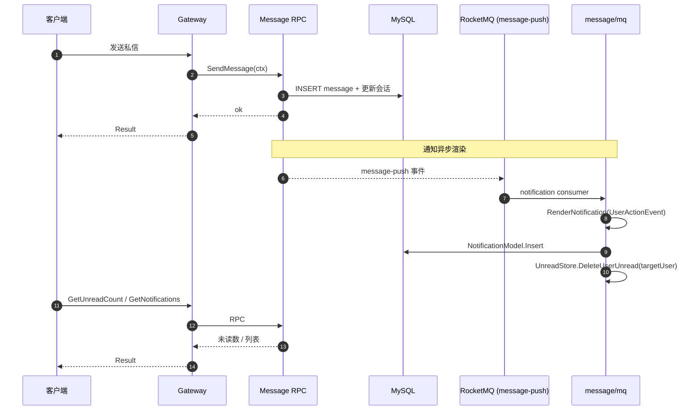

---

## 14. 事件总线全景（MQ 协作图）

RocketMQ topic 与消费者组定义见 `pkg/mqx/topics.go`。下图汇总「生产者 → topic → 消费者组」的事件协作关系。

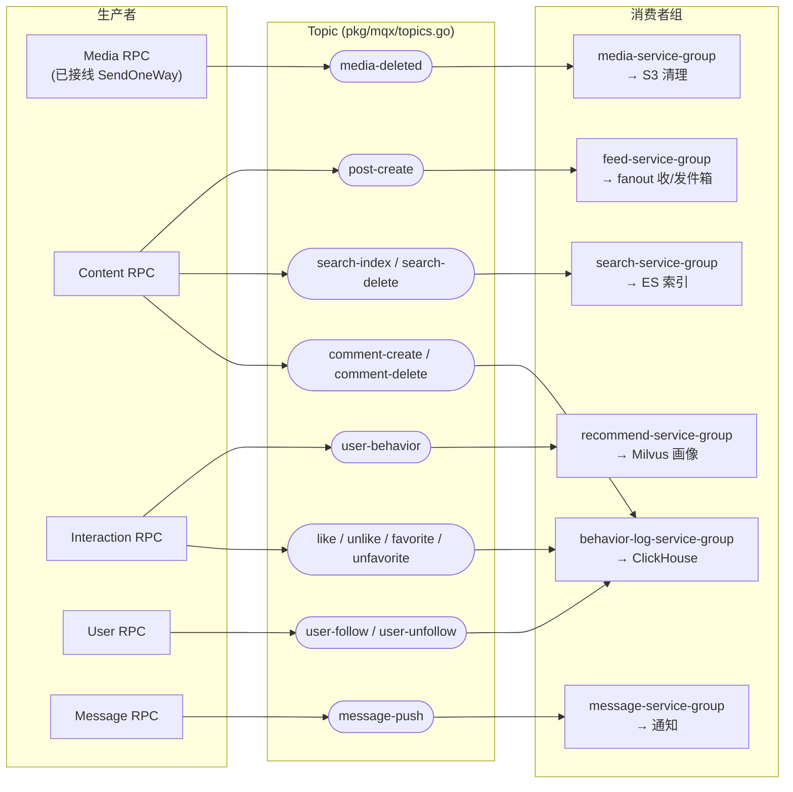

> 实现状态：`media-deleted` 为当前已接线的 MQ 生产者（`SendOneWay`）；发帖一致性走 **DTM 二阶段消息**（§6）直接驱动 Feed Fanout。其余 topic / 消费者已在 `pkg/mqx` 与各 `*/mq` 模块定义就绪，作为事件总线的统一契约。

---

## 15. 错误码与统一响应（流程图）

错误码集中于 `pkg/errx/codes.go`（通用 1-999 / 用户 1000-1999 / 内容 2000-2999 / 交互 3000-3999 / 媒体 4000-4999 / 搜索 5000-5999）。Logic 层统一返回 `errx.New(code, msg)`，跨进程经 gRPC status 传播，Gateway 侧由 `bizErrInterceptor` 还原后映射 HTTP 状态码。

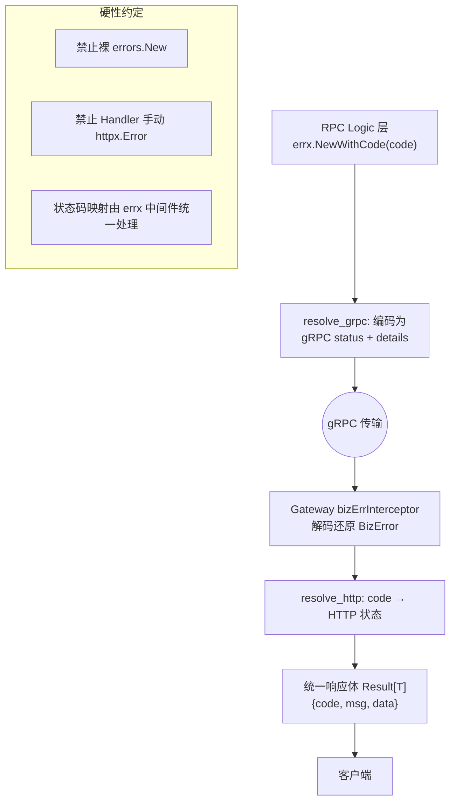

---

## 16. 部署拓扑（组件图）

`deploy/docker-compose.middleware.yml` 提供完整本地依赖栈，统一接入 `xbh-network`。

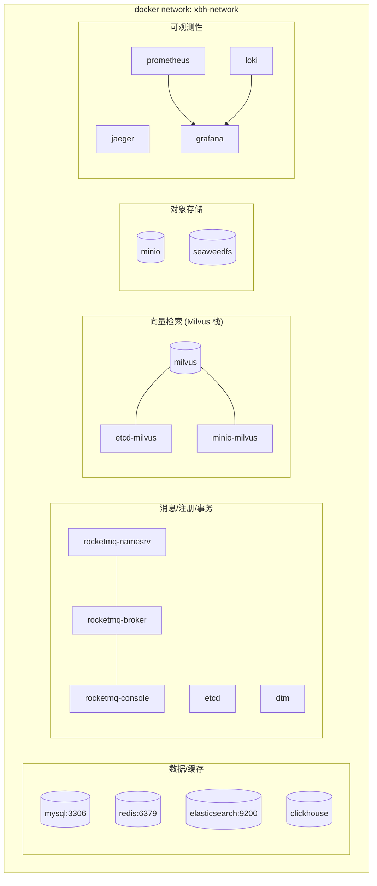

---

## 17. 整体数据流转全景图

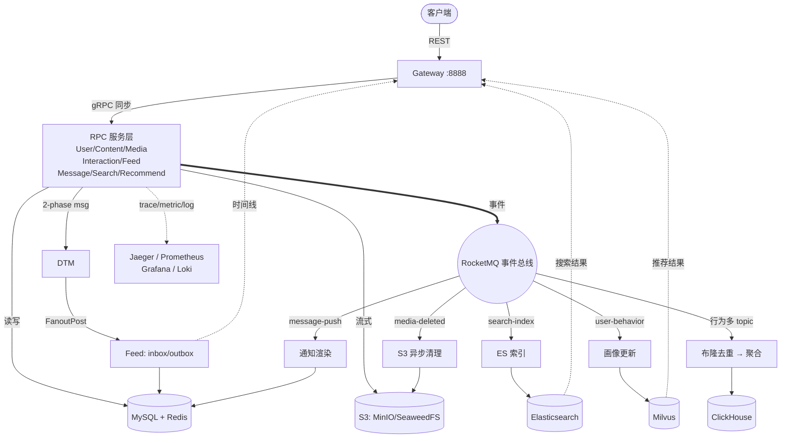

---

> 维护说明：本规格随 `proto/`、`app/*/internal/logic`、`pkg/mqx/topics.go` 变更同步更新。
> 图中「DTM 二阶段消息」与「media-deleted 事件」为当前已接线路径，其余 topic 为事件总线统一契约（消费者已就绪，生产者陆续接入）。
